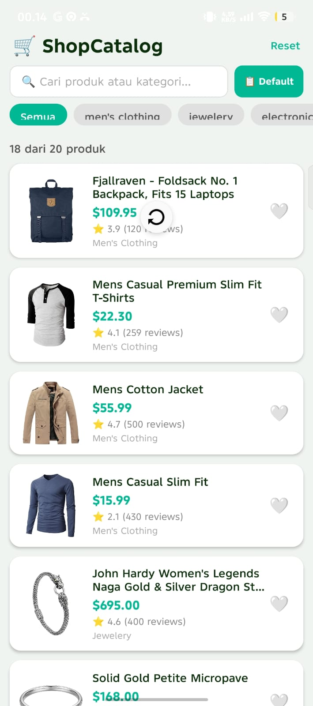
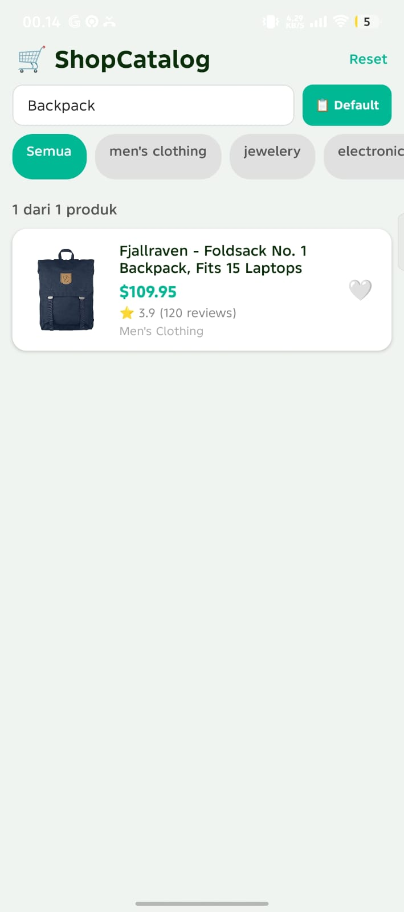
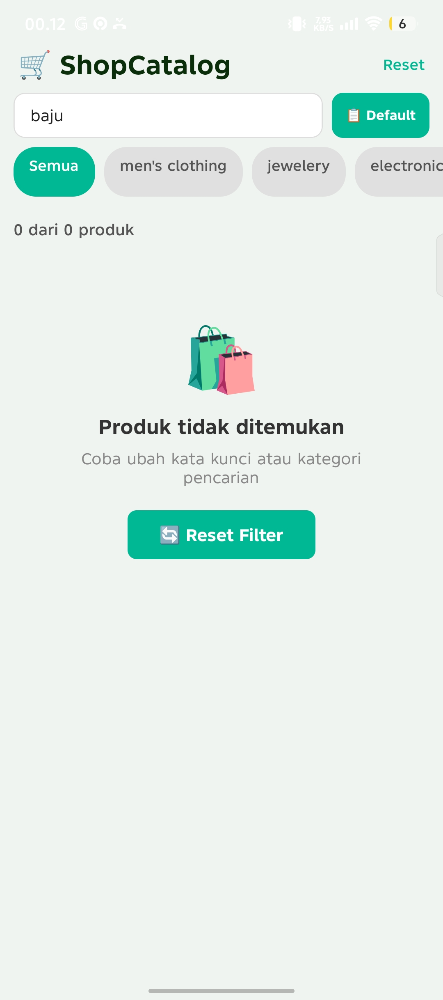
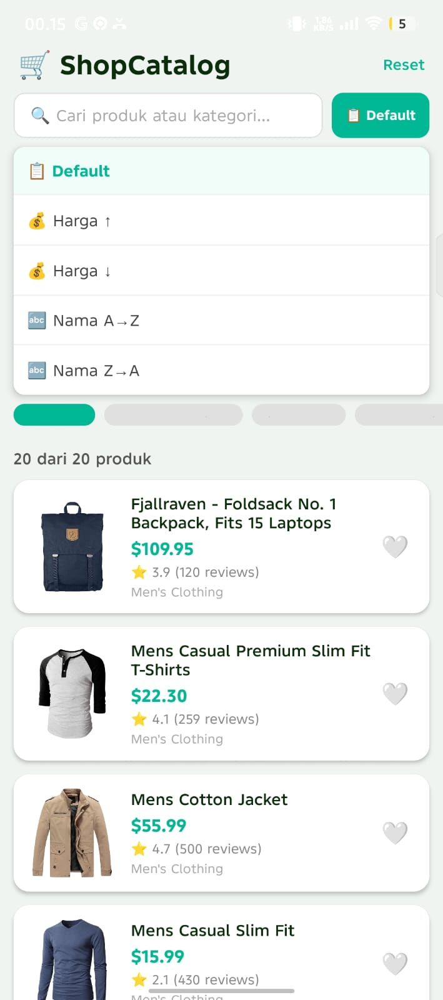

# 🛒 ShopCatalog

Aplikasi mobile katalog produk berbasis React Native (Expo) yang mengonsumsi REST API [FakeStore API](https://fakestoreapi.com). Dibangun sebagai tugas Misi 11 dengan implementasi fitur Level 1, Level 2, dan Level 3 secara penuh.

---

## 📱 Screenshots

### Loading State
<!-- Ganti gambar di bawah dengan screenshot asli kamu (drag & drop ke repo GitHub) -->
| Loading (Skeleton) | Success | Error |
|---|---|---|
|  |  |  |

### Fitur Tambahan
| Urutan | 
|---|---|---|
|  |
> 📌 **Cara upload screenshot:** buat folder `screenshots/` di root repo, lalu drag & drop file PNG dari Expo Go ke GitHub atau jalankan `git add screenshots/` setelah disimpan.

---

## 🌐 API yang Digunakan

**FakeStore API** — `https://fakestoreapi.com/products`

- Mengembalikan array produk dengan field: `id`, `title`, `price`, `image`, `rating`, `category`, `description`
- Gratis, tanpa API key, mendukung HTTPS

---

## ✅ Daftar Fitur

### 🟢 Level 1 — Core (Wajib)
- [x] Fetch data dari REST API dengan `axios` + `async/await`
- [x] `useEffect` dengan dependency array `[]` (fetch sekali saat mount)
- [x] 3 kondisi UI: **Loading** · **Error** · **Success**
- [x] `try / catch / finally` — loading selalu dimatikan di `finally`
- [x] `FlatList` dengan `data`, `renderItem`, `keyExtractor`
- [x] Kartu item menampilkan: gambar, judul, harga, rating, kategori
- [x] Tombol **Coba Lagi** memanggil ulang fungsi fetch

### 🟡 Level 2 — Pengembangan
- [x] 🔄 **Pull-to-Refresh** — tarik layar ke bawah untuk reload data
- [x] 🔎 **Search / Filter** — TextInput filter realtime berdasarkan judul & kategori
- [x] 📄 **Layar Detail** — tap kartu → Modal dengan deskripsi lengkap + toggle favorit
- [x] 🗂️ **Filter Kategori** — chip horizontal dinamis dari data API
- [x] 🎨 **Empty State** — ilustrasi ramah + tombol "Reset Filter" saat hasil kosong

### 🔴 Level 3 — Bonus
- [x] 📜 **Pagination / Infinite Scroll** — `onEndReached` load 6 item per scroll
- [x] ❤️ **Favorit Lokal** — tandai favorit dengan `AsyncStorage`, persisten antar sesi
- [x] 🔀 **Sorting** — 4 opsi: Harga ↑↓ dan Nama A→Z / Z→A lewat dropdown menu
- [x] 💀 **Skeleton Loading** — placeholder animasi pulse saat loading (bukan spinner biasa)
- [x] ✨ **Animasi Fade-in** — tiap kartu muncul dengan `Animated.timing` saat pertama render

---

## ⚙️ Cara Menjalankan

### Prasyarat
- Node.js ≥ 18
- Expo CLI (`npm install -g expo-cli`)
- Aplikasi **Expo Go** di HP (Android/iOS)
- HP dan laptop terhubung ke WiFi yang sama

### Setup

```bash
# 1. Clone repo
git clone https://github.com/USERNAME/shop-catalog.git
cd shop-catalog

# 2. Install dependencies
npm install

# 3. Install AsyncStorage
npx expo install @react-native-async-storage/async-storage

# 4. Jalankan
npx expo start
```

Scan QR code yang muncul di terminal menggunakan aplikasi **Expo Go**.

---

## 🧪 Test Case

| # | Skenario | Langkah | Hasil yang Diharapkan |
|---|----------|---------|----------------------|
| 1 | **Loading** | Buka app pertama kali | Skeleton placeholder beranimasi muncul |
| 2 | **Success** | Tunggu fetch selesai | Daftar produk tampil dengan gambar, harga, rating |
| 3 | **Error** | Matikan WiFi, tekan Coba Lagi | Pesan error + tombol Coba Lagi muncul |
| 4 | **Search** | Ketik "jacket" di search bar | List difilter realtime |
| 5 | **Kategori** | Tap chip "electronics" | Hanya produk elektronik tampil |
| 6 | **Sort** | Tap tombol sort → Harga ↑ | Produk urut dari termurah |
| 7 | **Detail** | Tap salah satu kartu | Modal terbuka dengan deskripsi lengkap |
| 8 | **Favorit** | Tap ❤️ di kartu / modal | Favorit tersimpan, tetap ada setelah app ditutup |
| 9 | **Infinite Scroll** | Scroll ke bawah | 6 item berikutnya ter-load otomatis |
| 10 | **Pull Refresh** | Tarik layar ke bawah | Data diambil ulang dari API |

---

## 🛠️ Tech Stack

| Teknologi | Keterangan |
|-----------|------------|
| React Native | Framework UI mobile |
| Expo SDK 54 | Build & development toolchain |
| Axios | HTTP client untuk fetch API |
| AsyncStorage | Penyimpanan lokal persisten (favorit) |
| Animated API | Animasi fade-in kartu & skeleton pulse |
| FakeStore API | Sumber data produk (gratis, tanpa key) |

---

## 🔗 Links

- **Expo Snack:** [snack.expo.dev/...](https://snack.expo.dev/@shb73/shopcatalog) ← *ganti dengan link Snack kamu*

---

## 📝 Commit History (Conventional Commits)

```
feat: initial project setup with Expo
feat: add fetch products from FakeStore API
feat: implement 3-state UI (loading, error, success)
feat: add FlatList with product cards
feat: add pull-to-refresh
feat: add search and category filter
feat: add product detail modal
feat: add sorting dropdown (price & name)
feat: add skeleton loading animation
feat: add fade-in animation on product cards
feat: add favorites with AsyncStorage persistence
feat: add infinite scroll pagination
feat: add empty state UI
docs: add README with screenshots and setup guide
```

---

*Dibuat untuk Misi 11 — Build Your Own API App*
